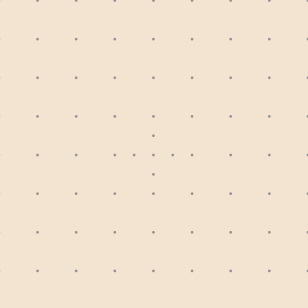

# Dot Paper Generator

Generate dot-grid PDF files for digital note-taking.

## Example Output

<p align="center">
  
</p>

The generated page features a centered dot grid with a **center cross** (half-spacing dots marking the exact center) and **corner markers** at the 1/3 and 2/3 page divisions:

<p align="center">
  
</p>

## Installation

```bash
git clone https://github.com/daniel-kok/dot-grid-generator.git
cd dot-grid-generator
poetry install
```

## Usage

### Command Line

Generate a dot-grid PDF with default settings:

```bash
poetry run python -m dot_paper_generator.generator
```

This creates a `dot_paper.pdf` in the current directory.

### Python API

```python
from dot_paper_generator.generator import generate_dot_paper

# Generate with default settings
generate_dot_paper()

# Customize the output
generate_dot_paper(
    output_path="my_dot_paper.pdf",
    page_width_inches=8.5,       # US Letter width
    page_height_inches=11.0,     # US Letter height
    dot_spacing_mm=5.0,          # Distance between dots
    bg_color="#F3E4D2",          # Background color (hex)
    dot_color="#929292",         # Dot color (hex)
    dot_radius_pt=0.5,          # Dot size in points
    margin_mm=5.0,              # Page margin
)
```

### Default Settings

| Parameter            | Default     | Description                        |
|----------------------|-------------|------------------------------------|
| `output_path`        | `dot_paper.pdf` | Output file path               |
| `page_width_inches`  | `6.32`      | Page width in inches               |
| `page_height_inches` | `8.17`      | Page height in inches              |
| `dot_spacing_mm`     | `5.0`       | Spacing between dots in mm         |
| `bg_color`           | `#F3E4D2`   | Background color (warm cream)      |
| `dot_color`          | `#929292`   | Dot color (medium gray)            |
| `dot_radius_pt`      | `0.5`       | Dot radius in points               |
| `margin_mm`          | `None`      | Margin in mm (defaults to spacing) |
